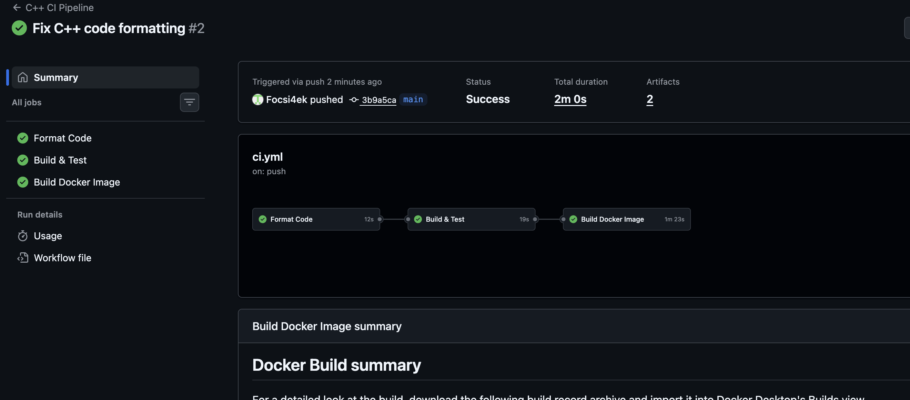
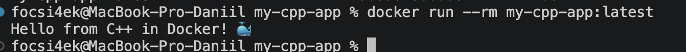

# 💻 C++ CI Pipeline with GitHub Actions

**Автор:** Абрамов Даниил Сергеевич

Учебный проект для изучения **Continuous Integration (CI)** на примере простого приложения на C++.

Проект автоматически проверяется через **GitHub Actions**: выполняется проверка форматирования исходного кода, сборка через CMake, запуск unit-тестов с Google Test, после чего собирается Docker-образ, сохраняется как Artifact и запускается для финальной проверки.

---

## 🎯 Цель проекта

Основная цель — настроить полноценный CI Pipeline для C++-проекта и разобраться во взаимодействии:

- C++
- CMake
- Google Test
- clang-format
- GitHub Actions
- Docker

В рамках проекта реализованы:

- автоматический запуск CI при push
- запуск CI при Pull Request
- ручной запуск workflow
- проверка форматирования через clang-format
- сборка через CMake
- unit-тестирование через Google Test
- Release-сборка
- multi-stage Docker build
- запуск приложения от непривилегированного пользователя
- Docker Buildx
- кэширование Docker-сборки
- сохранение Docker-образа как Artifact
- автоматическая проверка запуска готового контейнера

---

## 🛠️ Используемые технологии

| Технология | Назначение |
|---|---|
| 💻 C++17 | Основной язык приложения |
| 🔧 CMake | Система сборки |
| 🧪 Google Test | Unit-тестирование |
| 🎨 clang-format | Проверка форматирования |
| ⚙️ GitHub Actions | Автоматизация CI |
| 🐳 Docker | Контейнеризация |
| 🏗️ Docker Buildx | Расширенная сборка Docker-образа |
| 📦 GitHub Artifacts | Хранение Docker-образа |
| Git | Контроль версий |
| GitHub | Хранение исходного кода |

---

## 📁 Структура проекта

    my-cpp-app/
    ├── .github/
    │   └── workflows/
    │       └── ci.yml
    │
    ├── src/
    │   └── main.cpp
    │
    ├── tests/
    │   └── test.cpp
    │
    ├── CMakeLists.txt
    ├── Dockerfile
    ├── .dockerignore
    ├── .gitignore
    ├── README.md
    ├── 01-github-actions-success.png
    └── 02-docker-run-success.png

---

# 💻 Приложение

Основной код находится в:

    src/main.cpp

Приложение содержит функцию:

    getGreeting()

Она возвращает:

    Hello from C++ in Docker! 🐳

Основной код:

    #include <iostream>
    #include <string>

    std::string getGreeting() { return "Hello from C++ in Docker! 🐳"; }

    int main() {
      std::cout << getGreeting() << std::endl;
      return 0;
    }

---

# 🔧 CMake

Для сборки используется:

**CMake**

Основная конфигурация находится в:

    CMakeLists.txt

В проекте используется стандарт:

    C++17

Настройка:

    set(CMAKE_CXX_STANDARD 17)
    set(CMAKE_CXX_STANDARD_REQUIRED ON)

Основное приложение собирается как:

    my_app

---

# 🧪 Google Test

Unit-тесты находятся в:

    tests/test.cpp

Для проверки используется **Google Test**.

Тестируется:

- точное значение приветственной строки
- наличие текста `C++`
- наличие текста `Docker`

Пример:

    TEST(GreetingTest, ReturnsCorrectString) {
      EXPECT_EQ(getGreeting(), "Hello from C++ in Docker! 🐳");
    }

Дополнительная проверка:

    TEST(GreetingTest, ContainsKeywords) {
      std::string greeting = getGreeting();

      EXPECT_TRUE(greeting.find("C++") != std::string::npos);
      EXPECT_TRUE(greeting.find("Docker") != std::string::npos);
    }

---

# ⚙️ Условная сборка тестов

В `CMakeLists.txt` используется:

    option(BUILD_TESTS "Build unit tests" OFF)

По умолчанию тесты отключены.

Для CI они включаются:

    -DBUILD_TESTS=ON

Это позволяет:

- в Docker собирать только основное приложение
- в CI отдельно собирать и запускать unit-тесты

---

# 🎨 clang-format

Перед сборкой GitHub Actions проверяет форматирование исходного кода.

Используется:

    jidicula/clang-format-action@v4.13.0

Версия:

    clang-format 17

Проверяемый каталог:

    src/

Если код не соответствует ожидаемому стилю, job завершается ошибкой и дальнейшая сборка не запускается.

---

# ⚙️ GitHub Actions

Workflow находится по пути:

    .github/workflows/ci.yml

Название:

    C++ CI Pipeline

Pipeline запускается при:

    push

    pull_request

Также доступен ручной запуск:

    workflow_dispatch

---

# 🔄 CI Pipeline

Общая схема:

    Developer
        │
        │ git push
        ▼
    GitHub Repository
        │
        ▼
    GitHub Actions
        │
        ▼
    ┌──────────────────────────────┐
    │         Format Code          │
    │                              │
    │       clang-format           │
    └──────────────┬───────────────┘
                   │
                   │ Success
                   ▼
    ┌──────────────────────────────┐
    │        Build & Test          │
    │                              │
    │       CMake Configure        │
    │       CMake Build            │
    │       Google Test            │
    └──────────────┬───────────────┘
                   │
                   │ Success
                   ▼
    ┌──────────────────────────────┐
    │      Build Docker Image      │
    │                              │
    │       Docker Buildx          │
    │       Save Artifact          │
    │       Test Container         │
    └──────────────┬───────────────┘
                   │
                   ▼
               ✅ Success

---

# 🚀 Этапы GitHub Actions

## 1. Checkout

GitHub Actions получает содержимое репозитория:

    actions/checkout@v4

---

## 2. Format Code

Проверка исходного кода выполняется через:

    clang-format

Если форматирование не соответствует требованиям, Pipeline останавливается.

---

## 3. Установка зависимостей

Для сборки и тестирования устанавливаются:

    cmake
    g++
    libgtest-dev

Они необходимы для:

- компиляции C++
- работы CMake
- запуска Google Test

---

## 4. Configure CMake

Проект конфигурируется командой:

    cmake -B build \
      -DCMAKE_BUILD_TYPE=Release \
      -DBUILD_TESTS=ON

Каталог сборки:

    build/

---

## 5. Build

Сборка выполняется:

    cmake --build build --config Release

В результате создаются:

    my_app
    my_test

---

## 6. Tests

Для запуска тестов используется:

    ctest

Команда:

    ctest -C Release --output-on-failure

При ошибке подробный вывод отображается в логах GitHub Actions.

---

# 🔗 Зависимости между Jobs

Jobs выполняются последовательно:

    Format Code
          ↓
    Build & Test
          ↓
    Build Docker Image

Для зависимости используется:

    needs: format

и:

    needs: build-and-test

Если любой предыдущий этап завершается ошибкой, следующие jobs не запускаются.

---

# 🐳 Docker

Для контейнеризации используется multi-stage Docker build.

Первый этап отвечает за компиляцию C++-приложения.

Второй этап содержит только минимальное runtime-окружение и готовый бинарный файл.

---

## 🏗️ Docker Architecture

    ┌────────────────────────────┐
    │       ubuntu:22.04         │
    │                            │
    │       Builder Stage        │
    └──────────────┬─────────────┘
                   │
                   ▼
          build-essential
               + CMake
                   │
                   ▼
             Compile C++
                   │
                   ▼
                my_app
                   │
                   ▼
    ┌────────────────────────────┐
    │       ubuntu:22.04         │
    │                            │
    │       Runtime Stage        │
    └──────────────┬─────────────┘
                   │
                   ▼
               appuser
                   │
                   ▼
               ./my_app

---

# 🐳 Dockerfile

Dockerfile использует два этапа.

На первом устанавливаются:

    build-essential
    cmake

После чего выполняется:

    cmake .. -DBUILD_TESTS=OFF

и:

    cmake --build . --target my_app

На runtime-этап копируется только готовый бинарный файл.

---

# 🔐 Непривилегированный пользователь

В runtime-контейнере создаётся:

    appuser

После чего приложение запускается от его имени:

    USER appuser

Это безопаснее, чем запуск от root.

---

# 🚫 .dockerignore

Для уменьшения Docker build context исключаются:

    build/
    .git/
    .github/
    .gitignore
    .dockerignore
    *.md
    *.log
    Dockerfile
    tests/

В итоговую сборку не попадают файлы, которые не нужны для запуска приложения.

---

# 🚫 .gitignore

Каталог локальной сборки не должен попадать в Git:

    build/

Также можно исключить:

    .DS_Store

---

# 🧪 Локальная проверка Google Test

C++-окружение необязательно устанавливать на macOS.

Проверить тесты можно внутри Ubuntu-контейнера:

    docker run --rm \
      -v "$(pwd):/app" \
      -w /app \
      ubuntu:22.04 \
      bash -c "apt-get update && apt-get install -y build-essential cmake libgtest-dev && cmake -B build -DBUILD_TESTS=ON && cmake --build build && cd build && ctest --output-on-failure"

Ожидаемый результат:

    100% tests passed, 0 tests failed

---

# 🔨 Локальная сборка Docker

Собрать образ:

    docker build -t my-cpp-app:latest .

Проверить:

    docker images | grep my-cpp-app

---

# ▶️ Запуск контейнера

Запуск:

    docker run --rm my-cpp-app:latest

Ожидаемый вывод:

    Hello from C++ in Docker! 🐳

Параметр:

    --rm

автоматически удаляет контейнер после завершения работы.

---

# 🏗️ Docker Buildx

В GitHub Actions используется:

    docker/setup-buildx-action@v3

Docker Buildx предоставляет расширенные возможности сборки и поддержку GitHub Actions Cache.

---

# ⚡ Docker Cache

Настроено:

    cache-from: type=gha
    cache-to: type=gha,mode=max

Это позволяет повторно использовать Docker-слои между запусками Pipeline.

---

# 📦 Docker Image Artifact

После сборки Docker-образ сохраняется:

    docker save my-cpp-app:latest -o /tmp/docker-image.tar

После чего архивируется:

    gzip /tmp/docker-image.tar

Полученный файл:

    docker-image.tar.gz

загружается как Artifact:

    docker-image

Срок хранения:

    7 дней

---

# 🧪 Проверка Docker-образа в CI

После сборки Pipeline автоматически запускает:

    docker run --rm my-cpp-app:latest

Таким образом проверяется не только успешность сборки, но и реальный запуск готового контейнера.

---

# 🖥️ Результат GitHub Actions

После push автоматически запускается весь Pipeline.

Успешно должны завершиться:

- Format Code — ✅
- Build & Test — ✅
- Build Docker Image — ✅
- Upload Artifact — ✅
- Test Docker Image — ✅

---

# 🐳 Результат локального запуска

Локальный запуск:

    docker run --rm my-cpp-app:latest

Результат:

    Hello from C++ in Docker! 🐳

---

# ✅ Что проверяет CI

| Этап | Инструмент |
|---|---|
| Получение исходного кода | actions/checkout |
| Форматирование | clang-format |
| Конфигурация проекта | CMake |
| Компиляция | g++ |
| Unit-тесты | Google Test |
| Запуск тестов | CTest |
| Docker Builder | Docker Buildx |
| Сборка образа | Docker |
| Сохранение образа | upload-artifact |
| Финальная проверка | docker run |

---

# 📌 Continuous Integration

Continuous Integration позволяет автоматически проверять изменения после каждого push.

Разработчик выполняет:

    git push

После этого GitHub Actions запускает:

    Checkout
        ↓
    clang-format
        ↓
    CMake Configure
        ↓
    CMake Build
        ↓
    Google Test
        ↓
    Docker Build
        ↓
    Save Artifact
        ↓
    Run Container
        ↓
      ✅ Success

---

# 🔁 Повторный запуск Pipeline

После изменения проекта:

    git add .
    git commit -m "Update C++ application"
    git push

GitHub Actions автоматически запускает новый Pipeline.

Также его можно запустить вручную:

**GitHub → Actions → C++ CI Pipeline → Run workflow**

---

# 🟢 Успешный результат

Успешное выполнение Pipeline подтверждает, что:

- C++-код отформатирован корректно
- проект успешно конфигурируется через CMake
- исходный код компилируется
- unit-тесты проходят
- Dockerfile корректен
- Docker-образ успешно собирается
- Artifact сохраняется
- контейнер запускается без ошибок
- приложение выводит ожидаемый результат

---

# 📚 Полученные навыки

В рамках проекта были освоены:

- настройка CI Pipeline для C++
- работа с GitHub Actions
- использование CMake
- сборка C++17-проектов
- работа с Google Test
- использование CTest
- проверка форматирования через clang-format
- multi-stage Docker build
- контейнеризация C++-приложения
- запуск от непривилегированного пользователя
- Docker Buildx
- кэширование Docker-сборок
- сохранение Docker-образов как Artifact
- построение зависимых CI jobs

---

# 🎯 Итог

В проекте создан полноценный учебный **CI Pipeline для C++-приложения**.

GitHub Actions автоматически проверяет форматирование исходного кода, собирает проект через CMake, запускает Google Test, создаёт Docker-образ, сохраняет его как Artifact и выполняет финальный запуск контейнера.

Итоговая схема:

    Code
      ↓
    Format
      ↓
    CMake
      ↓
    Build
      ↓
    Tests
      ↓
    Docker Build
      ↓
    Artifact
      ↓
    Container Test
      ↓
    ✅ Success

Проект демонстрирует практический пример построения CI для C++ с использованием **GitHub Actions, CMake, Google Test и Docker**.

---

## 👨‍💻 Автор

**Абрамов Даниил Сергеевич**

**C++ CI Pipeline © 2026**